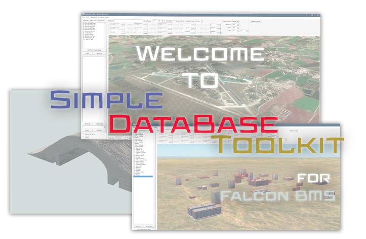

# Simple Database Toolkit

## Purpose

The Simple Database Toolkit is a powerful utility designed to streamline and automate various tasks related to database management for the Falcon BMS simulator. This tool aims to simplify complex operations, reduce manual work, and ensure consistency across multiple files and folders in the database.

## Features

### 1. Replace Page

   - Automates the process of updating feature numbers in FED (Feature Element Data) XML files
   - Supports both single folder and multiple folder (All) modes
   - Allows users to specify the feature number to remove and the new feature number to place
   - Processes FED_XXXXX.xml files in selected folders
   - Provides a summary log of changes made

### 2. Offset Fixer Page

  - Allows users to adjust offsets and rotations for specific features in XML files
  - Supports both single folder and multiple folder (All) modes
  - Enables adjustment of XY offsets, Z offset, rotation, or value
  - Calculates new offsets based on the feature's heading
  - Updates FED_XXXXX.xml files with new offset values
  - Provides a log of changes made

### 3. Runway Dimension Fixer Page

  - Automates the process of updating runway heading in PHD XML files
  - Ensures consistency between RunwayListType and RunwayDimType data
  - Supports both single folder and multiple folder (All) modes
  - Allows selection between first and second choice of heading data
  - Processes PHD_XXXXX.xml files in selected folders
  - Provides a log of changes and any issues encountered

### 4. Folders Creator Page

  - Automates the process of creating multiple folders with numerical names
  - Allows users to specify a start and end number for folder names
  - Lets users select a target directory for folder creation
  - Creates folders with names ranging from the start to end number
  - Prevents overwriting of existing folders

### 5. Rebuild Parents

  - Ensures consistency in parent.dat file formatting
  - Automates the process of rebuilding parent files before integrating them into the database
  - Supports both single file and multiple folder (All) modes
  - Reformats parent.dat files to a standardized format
  - Renames all processed files to "Parent.dat"
  - Provides an option to convert .lod files to .bml files
  - Checks for mismatches between BML files mentioned in parent.dat and those present in the folder

## Usage
Each feature of the Simple Database Toolkit is accessible through a dedicated tab in the user interface. Users can select the desired operation, input the necessary parameters, and execute the task with a single click. The tool provides detailed logs and summaries for each operation, allowing users to review the changes made and address any issues that may arise.

