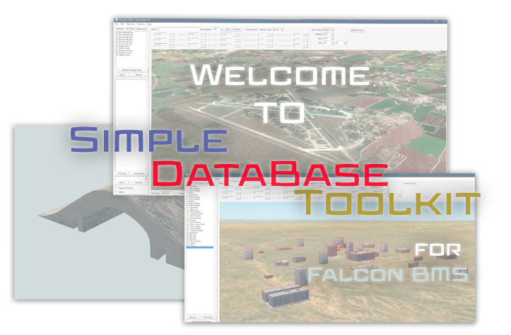

# Simple Database Toolkit for Falcon BMS

Simple Database Toolkit v2.2 provides a Windows workspace for inspecting and
editing Falcon BMS theater database and model files. It replaces the legacy
interface with a PySide6 GUI, background operations, and clearer diagnostics.

## Windows release

Download the complete Windows bundle from [GitHub Releases](https://github.com/AsafBSh/SimpleDatabaseToolkit_BMS/releases).
Extract the entire ZIP, then run `SimpleDatabaseToolkit_v2.2.exe` from the
extracted folder. Keep the `_internal` directory beside the executable.
Python installation is not required for the Windows bundle.

The full Windows release includes the BML skinset and material editor. Its
implementation is excluded from this public source repository; building the
public source produces a seven-tool `SourceEdition` without that editor.

See [CHANGELOG.md](CHANGELOG.md) for the v2.2 release changes.

## GUI enhancements

- Grouped sidebar navigation brings features, airbase tools, database tools,
  model editing, and help into one workspace.
- Persistent **White, Grey, and Black** themes style the workspace, navigation,
  controls, and diagnostic panels.
- Overview combines application health, quick actions, recent target paths,
  and the original toolkit artwork.
- Every launch opens Overview. Release settings stay local to the current user
  and PC, separate from development settings. New installations start with an
  empty recent-target history; a user's own history persists between launches.
- Refined typography, spacing, control sizes, and responsive layouts improve
  readability across tool pages.
- Target selectors explain the required file or folder for the selected mode.
- Structured diagnostics show time, severity, module, target, and message;
  session metrics summarize each operation.
- `Ctrl+K` opens command search; `Ctrl+1` through `Ctrl+9` navigate the full
  release's modules; `F1` opens searchable help and `Ctrl+F` searches its content.
- Help starts with Getting Started and explains files and terms before the
  numbered workflows. Each tool includes examples and guidance for checking
  results, including the runway heading rules and backup restoration.
- Background workers report progress and support cancellation. One operation
  runs across all pages at a time, so Cancel addresses the active task.

## Tools and features

| Tool | Capabilities |
|---|---|
| Replace Features | Scan and replace FeatureCtIdx values in one objective or an entire theater. |
| Offset Fixer | Scan features; adjust XY offsets, rotate headings, or set Z, heading, and value fields. |
| Runway Fixer | Check runway list headings, dimension assignments/headings, crossings, and taxi paths; inspect diagnostics and embedded before/after maps. |
| Parking Fixer | Preview selected or all Type-45 hangar parking moves before applying them, with stale-preview protection. |
| Folder Creator | Create numbered model folders and their Parent.dat files. |
| Reformat Parents | Validate and normalize Parent.dat, check model references, and optionally convert LOD filename references to BML. |
| Links Generator | Rebuild or update objective links from CSV data, with LUT and intersection options. |
| BML Editor — Windows release | Inspect model folders; edit v1 texture IDs and skinsets or rename v2 materials, with coordinated side-file updates. |

### Runway heading behavior

Within the configurable heading cone (4–6°, default 5°), minor heading errors
snap to the closest valid runway end. A heading already matching either runway
end is preserved even when the other end has priority. First/Second priority
applies outside the cone; **Force** deliberately overrides that protection.
Diagnostics explain the heading decision and whether a change was made.

### Backups and file safety

The shared **Back up edited files** setting covers the standard write tools.
The backup destination is configurable from Overview. BML saves use their own
backup choice. Timestamped snapshots retain original filenames and a restore
layout, manifest, and copy-back instructions.

XML value edits preserve declarations, line endings, comments, BOMs, and
unrelated layout. Writers use atomic replacement; coordinated runway and BML
writes provide rollback. Preview workflows recheck source data before apply.
Cancellation retains completed batch commits and reports that outcome.

## Source development

The PySide6 application is the main code at the repository root. Run
`Setup_Environment.cmd`, then `Launch_Simple_Database_Toolkit.cmd` from that
root. The previous `StructureAdjuster.py` GUI is available in Git history.

```text
app.py                          Application entry point
src/simple_database_toolkit/    Services, domain models, UI, and workers
tests/                          Service, GUI, and optional theater tests
Media/                          Artwork and application icon
tools/                          Read-only theater validation utility
```

```powershell
& "$env:USERPROFILE\.venvs\sdt\Scripts\python.exe" -m pytest
& "$env:USERPROFILE\.venvs\sdt\Scripts\python.exe" -m PyInstaller SimpleDatabaseToolkit_v2.2.spec
```

The source tree separates `services/`, `domain/`, `ui/`, and `workers/`. Tests
use temporary files. Building this checkout creates `SourceEdition`, rather
than the complete Windows release with the separately maintained BML editor.

## Validation and remaining work

The full workspace and independent public source pass automated service, GUI,
and publication checks. Installed-data acceptance passed
24 tests on temporary copies of Korea/Israel XML. All 9,198 original XML hashes
matched after testing. The full binary passed an offscreen startup smoke test;
that check does not automate editing through the frozen GUI.

The installer and automatic updater remain planned. Use the portable ZIP for
this release; the dashboard reports the updater's current status.

Maintained by [AsafBSh](https://github.com/AsafBSh).
